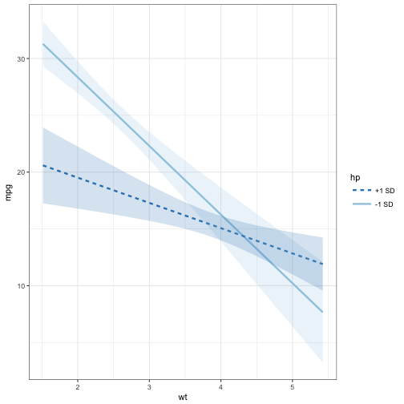
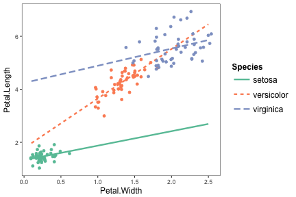
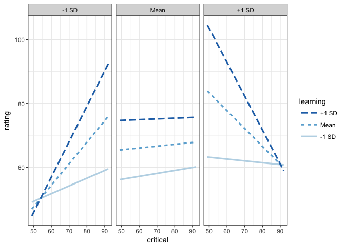
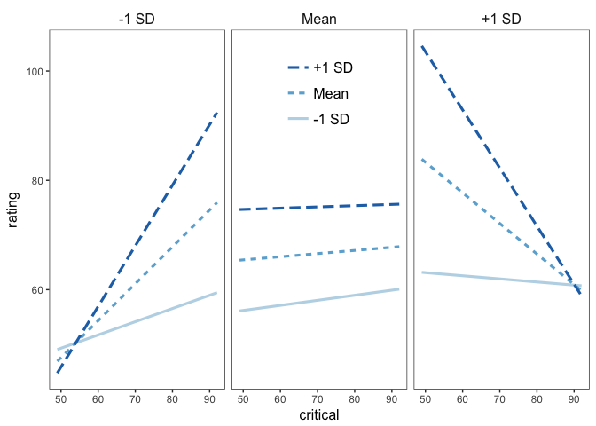

<!-- README.md is generated from README.Rmd. Please edit that file -->
jtools [](https://travis-ci.org/jacob-long/jtools) [](https://ci.appveyor.com/project/jacob-long/JTools) [](https://codecov.io/gh/jacob-long/jtools) [](https://opensource.org/licenses/MIT)
========================================================================================================================================================================================================================================================================================================================================================================================================================================================================================================================================================

This package consists of a series of functions created by the author (Jacob) to automate otherwise tedious research tasks. At this juncture, the unifying theme is the more efficient presentation of regression analyses, including those with interactions. Support for the `survey` package's `svyglm` objects is a common theme throughout.

**Note**: This is beta software. Bugs are possible, both in terms of code-breaking errors and more pernicious errors of mistaken computation.

Installation
------------

If you don't have `devtools` installed, first install it.

``` r
install.packages("devtools")
```

Then install the package from Github--it is not yet available from CRAN as it is in its early stages of development.

``` r
devtools::install_github("jacob-long/jtools")
```

Usage
-----

Here's a brief synopsis of the current functions in the package:

#### `j_summ()`

This is a replacement for `summary.lm` that provides the user several options for formatting regression summaries. It supports `glm` and `svyglm` objects as input as well, but it is not tested with nonlinear models. It supports calculation and reporting of robust standard errors via the `sandwich` and `lmtest` packages.

``` r
fit <- lm(mpg ~ hp*wt, data=mtcars)
j_summ(fit)
```

    #> MODEL INFO:
    #> Sample Size: 32
    #> Dependent Variable: mpg
    #> Number of Terms: 3
    #> 
    #> MODEL FIT: 
    #> F(3,28) = 71.66, p = 0
    #> R-squared = 0.885
    #> Adj. R-squared = 0.872
    #> 
    #> Standard errors: OLS 
    #>             Est.   S.E.  t val. p        
    #> (Intercept) 49.808 3.605 13.816 0     ***
    #> hp          -0.12  0.025 -4.863 0     ***
    #> wt          -8.217 1.27  -6.471 0     ***
    #> hp:wt       0.028  0.007 3.753  0.001 ***

It has some other conveniences as well, like re-fitting your model with standardized variables. I'm a fan of Andrew Gelman's 2 SD standardization method. You can also get a couple diagnostic checks for linear models along with multicollinearity information.

``` r
fit2 <- lm(Murder ~ Assault + UrbanPop, data = USArrests)
j_summ(fit2, standardize = TRUE, n.sd = 2, vifs = TRUE, robust = TRUE,
       model.check = TRUE)
```

    #> MODEL INFO:
    #> Sample Size: 50
    #> Dependent Variable: Murder
    #> Number of Terms: 2
    #> 
    #> MODEL FIT: 
    #> F(2,47) = 46.319, p = 0
    #> R-squared = 0.663
    #> Adj. R-squared = 0.649
    #> 
    #> MODEL CHECKING:
    #> Homoskedasticity (Breusch-Pagan) = Assumption not violated (p = 0.144)
    #> Number of high-leverage observations = 5
    #> 
    #> Standard errors: Robust, type = HC3
    #>             Est.   S.E.  t val. p         VIF  
    #> (Intercept) 0      0.043 0      1              
    #> Assault     0.84   0.094 8.982  0     *** 1.072
    #> UrbanPop    -0.148 0.092 -1.608 0.115     1.072
    #> 
    #> All continuous variables are mean-centered and scaled by 2 s.d.

#### `sim_slopes()`

This is an interface for simple slopes analysis for 2- and 3-way interactions. Users can specify values of the moderator to test or use the default +/- 1 SD values.

``` r
sim_slopes(fit, pred="wt", modx = "hp")
```

    #> Slope of wt when hp = 215.25 (+1 SD): 
    #>   Est.   S.E.      p 
    #> -2.222  0.686  0.003 
    #> 
    #> Slope of wt when hp = 146.688 (Mean): 
    #>   Est.   S.E.      p 
    #> -4.132  0.530  0.000 
    #> 
    #> Slope of wt when hp = 78.125 (-1 SD): 
    #>   Est.   S.E.      p 
    #> -6.041  0.780  0.000

#### `interact_plot()`

This function plots two-way interactions using `ggplot2` with a similar interface to the aforementioned `sim_slopes()` function. Users can customize the appearance with familiar `ggplot2` commands. It supports several customizations, like confidence intervals.

``` r
interact_plot(fit, pred="wt", modx = "hp", interval = T, int.width = .95)
```



The function also supports categorical moderators and plotting observed data points alongside best-fitting lines.

``` r
fitiris <- lm(Petal.Length ~ Petal.Width*Species, data = iris)
interact_plot(fitiris, pred = "Petal.Width", modx = "Species", plot.points = TRUE)
```



#### `probe_interaction()`

This function allows you to use the two above functions simultaneously, owing to their common syntax. Here is an example, which can also serve to show off how the 3-way interaction output looks.

``` r
fita3 <- lm(rating ~ privileges*critical*learning, data = attitude)
probe_interaction(fita3, pred = critical, modx = learning, mod2 = privileges)
```

    #> #######################################################
    #> While privileges (2nd moderator) = 65.36876 (+1 SD)
    #> #######################################################
    #> 
    #> Slope of critical when learning = 68.104 (+1 SD): 
    #>   Est.   S.E.      p 
    #> -1.063  0.658  0.120 
    #> 
    #> Slope of critical when learning = 56.367 (Mean): 
    #>   Est.   S.E.      p 
    #> -0.560  0.502  0.276 
    #> 
    #> Slope of critical when learning = 44.63 (-1 SD): 
    #>   Est.   S.E.      p 
    #> -0.057  0.614  0.927 
    #> 
    #> #######################################################
    #> While privileges (2nd moderator) = 53.13333 (Mean)
    #> #######################################################
    #> 
    #> Slope of critical when learning = 68.104 (+1 SD): 
    #>  Est.  S.E.     p 
    #> 0.023 0.330 0.946 
    #> 
    #> Slope of critical when learning = 56.367 (Mean): 
    #>  Est.  S.E.     p 
    #> 0.058 0.239 0.811 
    #> 
    #> Slope of critical when learning = 44.63 (-1 SD): 
    #>  Est.  S.E.     p 
    #> 0.093 0.340 0.788 
    #> 
    #> #######################################################
    #> While privileges (2nd moderator) = 40.8979 (-1 SD)
    #> #######################################################
    #> 
    #> Slope of critical when learning = 68.104 (+1 SD): 
    #>  Est.  S.E.     p 
    #> 1.109 0.553 0.057 
    #> 
    #> Slope of critical when learning = 56.367 (Mean): 
    #>  Est.  S.E.     p 
    #> 0.675 0.329 0.052 
    #> 
    #> Slope of critical when learning = 44.63 (-1 SD): 
    #>  Est.  S.E.     p 
    #> 0.242 0.237 0.318



#### `svycor()`

This function extends the `survey` package by calculating correlations with complex survey designs, a feature absent from `survey`. Users may request significance tests, which are calculated via bootstrap by calling the `weights` package.

``` r
library(survey)
data(api)
dstrat <- svydesign(id = ~1,strata = ~stype, weights = ~pw, data = apistrat, fpc=~fpc)

svycor(~api00+api99+dnum, design = dstrat, digits = 3, sig.stats = T, bootn = 2000)
```

    #>       api00  api99  dnum  
    #> api00 1      0.976* 0.254*
    #> api99 0.976* 1      0.244*
    #> dnum  0.254* 0.244* 1

#### `theme_apa()`

This will format your `ggplot2` graphics to make them (mostly) appropriate for APA style publications. There's no drop-in, perfect way to get plots into APA format sight unseen, but this gets you close and returns a `ggplot` object that can be further tweaked to your specification.

You might start with something like the above interaction plots and then use `theme_apa()` to tune it to APA specification. Note the `legend.pos` option:

``` r
p <- interact_plot(fitiris, pred = "Petal.Width", modx = "Species", plot.points = TRUE)
p + theme_apa(legend.pos = "topleft")
```


Facet grids like those produced by `interact_plot` for 3-way interactions are also supported, though APA guidance on these kinds of constructions is less than clear. The embedded legend has a nice space-saving quality, though some trial and error may be needed before finding the ideal `legend.pos` argument.

``` r
p2 <- probe_interaction(fita3, pred = critical, modx = learning, mod2 = privileges)
p2 <- p2$interactplot
p2 + theme_apa(legend.pos = "topmiddle") 
```



You may need to make further changes to please your publisher, of course. Since these are regular `ggplot` theme changes, it shouldn't be a problem.

#### Others

`gscale()`, `center_lm()`, `scale_lm()`, and `svysd()` each do some of the behind the scenes computation in the above functions, but could do well for end users as well. See the documentation for more.

Details on the arguments can be accessed via the R documentation (`?functionname`). There are now vignettes documenting just about everything you can do as well.

Contributing
------------

I'm happy to receive bug reports, suggestions, questions, and (most of all) contributions to fix problems and add features. I prefer you use the Github issues system over trying to reach out to me in other ways. Pull requests for contributions are encouraged.

Please note that this project is released with a [Contributor Code of Conduct](CONDUCT.md). By participating in this project you agree to abide by its terms.

License
-------

The source code of this package is licensed under the [MIT License](http://opensource.org/licenses/mit-license.php).
