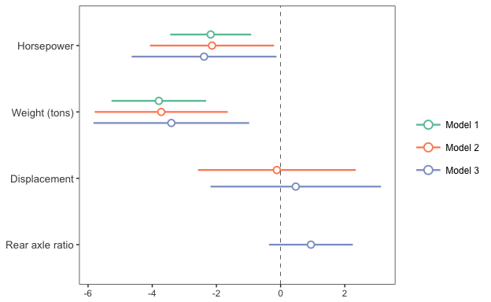
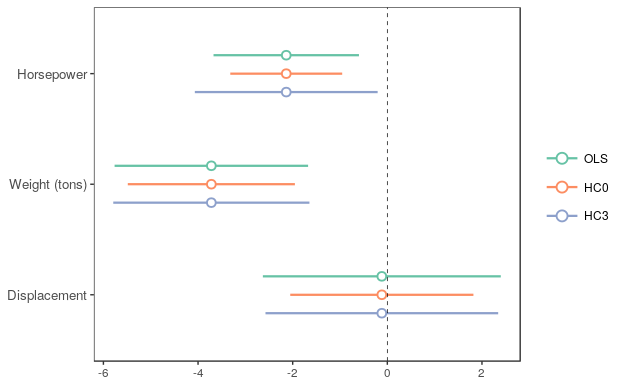
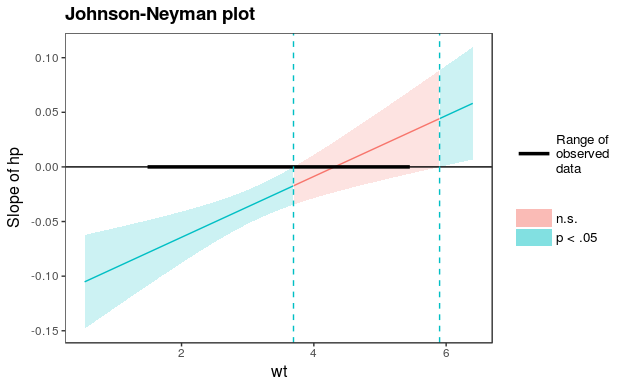
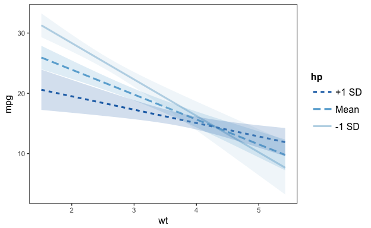
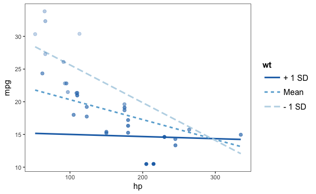
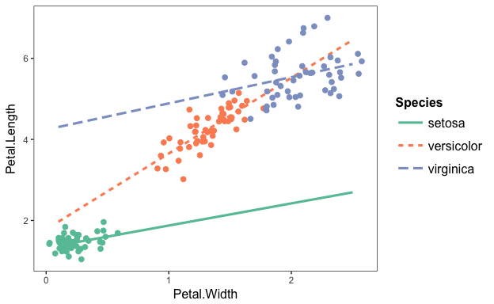
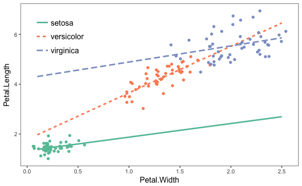

<!-- README.md is generated from README.Rmd. Please edit that file -->

# jtools

[](https://cran.r-project.org/package=jtools)
[](https://github.com/jacob-long/jtools)
[](https://travis-ci.org/jacob-long/jtools)
[](https://ci.appveyor.com/project/jacob-long/JTools)
[](https://codecov.io/gh/jacob-long/jtools)

<!-- [](http://www.repostatus.org/#active) [](https://opensource.org/licenses/MIT) -->

This package consists of a series of functions created by the author
(Jacob) to automate otherwise tedious research tasks. At this juncture,
the unifying theme is the more efficient presentation of regression
analyses. There are a number of functions for visualizing and doing
inference for interaction terms. Support for the `survey` package’s
`svyglm` objects as well as weighted regressions is a common theme
throughout.

**Note**: This is beta software. Bugs are possible, both in terms of
code-breaking errors and more pernicious errors of mistaken computation.

## Installation

For the most stable version, simply install from CRAN.

``` r
install.packages("jtools")
```

If you want the latest features and bug fixes (and perhaps the latest
bugs, too) then you can download from Github. To do that you will need
to have `devtools` installed if you don’t already:

``` r
install.packages("devtools")
```

Then install the package from Github.

``` r
devtools::install_github("jacob-long/jtools")
```

## Usage

Here’s a brief synopsis of the current functions in the package:

### Summarizing regressions (`summ`, `plot_summs`, `export_summs`)

`summ` is a replacement for `summary` that provides the user several
options for formatting regression summaries. It supports `glm`,
`svyglm`, and `merMod` objects as input as well. It supports calculation
and reporting of robust standard errors via the `sandwich` package.

Basic use:

``` r
fit <- lm(mpg ~ hp + wt, data = mtcars)
summ(fit)
```

    #> MODEL INFO:
    #> Observations: 32
    #> Dependent Variable: mpg
    #> 
    #> MODEL FIT: 
    #> F(2,29) = 69.21, p = 0
    #> R-squared = 0.83
    #> Adj. R-squared = 0.81
    #> 
    #> Standard errors: OLS 
    #>              Est. S.E. t val. p    
    #> (Intercept) 37.23 1.6   23.28 0 ***
    #> hp          -0.03 0.01  -3.52 0  **
    #> wt          -3.88 0.63  -6.13 0 ***

It has several conveniences, like re-fitting your model with scaled
variables (`scale = TRUE`). You have the option to leave the outcome
variable in its original scale (`scale.response = TRUE`), which is the
default for scaled models. I’m a fan of Andrew Gelman’s 2 SD
standardization method, so you can specify by how many standard
deviations you would like to rescale (`n.sd = 2`).

You can also get variance inflation factors (VIFs) and
partial/semipartial (AKA part) correlations. Partial correlations are
only available for OLS models. You may also substitute confidence
intervals in place of standard errors and you can choose whether to show
p values.

``` r
summ(fit, scale = TRUE, vifs = TRUE, part.corr = TRUE, confint = TRUE,
     pvals = FALSE)
```

    #> MODEL INFO:
    #> Observations: 32
    #> Dependent Variable: mpg
    #> 
    #> MODEL FIT: 
    #> F(2,29) = 69.21, p = 0
    #> R-squared = 0.83
    #> Adj. R-squared = 0.81
    #> 
    #> Standard errors: OLS 
    #>              Est.  2.5% 97.5% t val.  VIF partial.r part.r
    #> (Intercept) 20.09 19.19 20.99  43.82                      
    #> hp          -2.18 -3.39 -0.97  -3.52 1.77     -0.55  -0.27
    #> wt          -3.79 -5.01 -2.58  -6.13 1.77     -0.75  -0.47
    #> 
    #> All continuous predictors are mean-centered and scaled by 1 s.d.

Cluster-robust standard errors:

``` r
data("PetersenCL", package = "sandwich")
fit2 <- lm(y ~ x, data = PetersenCL)
summ(fit2, robust = TRUE, cluster = "firm", robust.type = "HC3")
```

    #> MODEL INFO:
    #> Observations: 5000
    #> Dependent Variable: y
    #> 
    #> MODEL FIT: 
    #> F(1,4998) = 1310.74, p = 0
    #> R-squared = 0.21
    #> Adj. R-squared = 0.21
    #> 
    #> Standard errors: Cluster-robust, type = HC3
    #>             Est. S.E. t val.    p    
    #> (Intercept) 0.03 0.07   0.44 0.66    
    #> x           1.03 0.05  20.36 0    ***

Of course, `summ` like `summary` is best-suited for interactive use.
When it comes to share results with others, you want sharper output and
probably graphics. `jtools` has some options for that, too.

First, for tabular output, `export_summs` is an interface to the
`huxtable` package’s `huxreg` function that preserves the niceties of
`summ`, particularly its facilities for robust standard errors and
standardization. It also concatenates multiple models into a single
table.

``` r
fit <- lm(mpg ~ hp + wt, data = mtcars)
fit_b <- lm(mpg ~ hp + wt + disp, data = mtcars)
fit_c <- lm(mpg ~ hp + wt + disp + drat, data = mtcars)
export_summs(fit, fit_b, fit_c, scale = TRUE, scale.response = TRUE,
             note = "")
```

|             |       1       |      2      |      3      |
| ----------- | :-----------: | :---------: | :---------: |
| (Intercept) |  5.27e-17.00  | 4.98e-17.00 | 1.02e-16.00 |
|             |    (0.08)     |   (0.08)    |   (0.08)    |
| hp          |  \-0.36 \*\*  |  \-0.35 \*  | \-0.40 \*\* |
|             |    (0.10)     |   (0.13)    |   (0.13)    |
| wt          | \-0.63 \*\*\* | \-0.62 \*\* | \-0.56 \*\* |
|             |    (0.10)     |   (0.17)    |   (0.18)    |
| disp        |               |   \-0.02    |    0.08     |
|             |               |   (0.21)    |   (0.22)    |
| drat        |               |             |    0.16     |
|             |               |             |   (0.12)    |
| N           |      32       |     32      |     32      |
| R 2         |     0.83      |    0.83     |    0.84     |

In RMarkdown documents, using `export_summs` and the chunk option
`results = 'asis'` will give you nice-looking tables in HTML and PDF
output. Using the `to.word = TRUE` argument will create a Microsoft Word
document with the table in it.

Another way to get a quick gist of your regression analysis is to plot
the values of the coefficients and their corresponding uncertainties
with `plot_summs` (or the closely related `plot_coefs`). `jtools` has
made some slight changes to `ggplot2` geoms to make everything look
nice; and like with `export_summs`, you can still get your scaled models
and robust standard errors.

``` r
plot_summs(fit, fit_b, fit_c, scale = TRUE, robust = TRUE, 
    coefs = c("Horsepower" = "hp", "Weight (tons)" = "wt", 
        "Displacement" = "disp", "Rear axle ratio" = "drat"))
```

<!-- -->

And since you get a `ggplot` object in return, you can tweak and theme
as you wish.

`plot_coefs` works much the same way, but without support for `summ`
arguments like `robust` and `scale`. This enables a wider range of
models that have support from the `broom` package but not for `summ`.
And you can give `summ` objects to `plot_coefs` since this package
defines tidy methods for `summ` objects.

For instance, I could compare the confidence bands with different robust
standard error specifications using `plot_coefs` by giving the `summ`
objects as arguments.

``` r
summ_fit_1 <- summ(fit_b, scale = TRUE)
summ_fit_2 <- summ(fit_b, scale = TRUE, robust = TRUE,
                    robust.type = "HC0")
summ_fit_3 <- summ(fit_b, scale = TRUE, robust = TRUE,
                    robust.type = "HC3")
plot_coefs(summ_fit_1, summ_fit_2, summ_fit_3, 
           model.names = c("OLS","HC0","HC3"),
           coefs = c("Horsepower" = "hp", "Weight (tons)" = "wt", 
                    "Displacement" = "disp"))
```

<!-- -->

### Exploring interactions

Unless you have a really keen eye and good familiarity with both the
underlying mathematics and the scale of your variables, it can be very
difficult to look at the ouput of regression model that includes an
interaction and actually understand what the model is telling you.

This package contains several means of aiding understanding and doing
statistical inference with interactions.

#### Johnson-Neyman intervals and simple slopes analysis

The “classic” way of probing an interaction effect is to calculate the
slope of the focal predictor at different values of the moderator. When
the moderator is binary, this is especially informative—e.g., what is
the slope for men vs. women? But you can also arbitrarily choose points
for continuous moderators.

With that said, the more statistically rigorous way to explore these
effects is to find the Johnson-Neyman interval, which tells you the
range of values of the moderator in which the slope of the predictor is
significant vs. nonsignificant at a specified alpha level.

The `sim_slopes` function will by default find the Johnson-Neyman
interval and tell you the predictor’s slope at specified values of the
moderator; by default either both values of binary predictors or the
mean and the mean +/- one standard deviation for continuous moderators.

``` r
fiti <- lm(mpg ~ hp * wt, data = mtcars)
sim_slopes(fiti, pred = hp, modx = wt, jnplot = TRUE)
```

    #> JOHNSON-NEYMAN INTERVAL
    #> 
    #> The slope of hp is p < .05 when wt is OUTSIDE this interval:
    #> [3.69, 5.9]
    #> Note: The range of observed values of wt is [1.51, 5.42]

<!-- -->

    #> SIMPLE SLOPES ANALYSIS
    #> 
    #> Slope of hp when wt = 4.2 (+ 1 SD): 
    #> Est. S.E.    p 
    #> 0.00 0.01 0.76 
    #> 
    #> Slope of hp when wt = 3.22 (Mean): 
    #>  Est.  S.E.     p 
    #> -0.03  0.01  0.00 
    #> 
    #> Slope of hp when wt = 2.24 (- 1 SD): 
    #>  Est.  S.E.     p 
    #> -0.06  0.01  0.00

The Johnson-Neyman plot can really help you get a handle on what the
interval is telling you, too. Note that you can look at the
Johnson-Neyman interval directly with the `johnson_neyman` function.

The above all generalize to three-way interactions, too.

#### Visualizing interaction effects

This function plots two- and three-way interactions using `ggplot2` with
a similar interface to the aforementioned `sim_slopes` function. Users
can customize the appearance with familiar `ggplot2` commands. It
supports several customizations, like confidence intervals.

``` r
interact_plot(fiti, pred = hp, modx = wt, interval = TRUE)
```

<!-- -->

You can also plot the observed data for comparison:

``` r
interact_plot(fiti, pred = hp, modx = wt, plot.points = TRUE)
```

<!-- -->

The function also supports categorical moderators—plotting observed data
in these cases can reveal striking patterns.

``` r
fitiris <- lm(Petal.Length ~ Petal.Width * Species, data = iris)
interact_plot(fitiris, pred = Petal.Width, modx = Species, plot.points = TRUE)
```

<!-- -->

You may also combine the plotting and simple slopes functions by using
`probe_interaction`, which calls both functions simultaneously.
Categorical by categorical interactions can be investigated using the
`cat_plot` function.

### Other stuff

#### `theme_apa`

This will format your `ggplot2` graphics to make them (mostly)
appropriate for APA style publications. There’s no drop-in, perfect way
to get plots into APA format sight unseen, but this gets you close and
returns a `ggplot` object that can be further tweaked to your
specification.

The plots produced by other functions in this package use `theme_apa`,
but use its options to position the plots and alter other details to
make them more in line with `ggplot2` defaults than APA norms.

You might start with something like the above interaction plots and then
use `theme_apa` to tune it to APA specification. Note the `legend.pos`
option:

``` r
p <- interact_plot(fitiris, pred = "Petal.Width", modx = "Species", plot.points = TRUE)
p + theme_apa(legend.pos = "topleft")
```

<!-- -->

You may need to make further changes to please your publisher, of
course. Since these are regular `ggplot` theme changes, it shouldn’t be
a problem.

#### `svycor`

This function extends the `survey` package by calculating correlations
with complex survey designs, a feature absent from `survey`. Users may
request significance tests, which are calculated via bootstrap by
calling the `weights` package.

``` r
library(survey)
data(api)
dstrat <- svydesign(id = ~1, strata = ~stype, weights = ~pw, data = apistrat, fpc = ~fpc)

svycor(~ api00 + api99 + dnum, design = dstrat, sig.stats = TRUE)
```

    #>       api00 api99 dnum 
    #> api00 1     0.98* 0.25*
    #> api99 0.98* 1     0.24*
    #> dnum  0.25* 0.24* 1

#### Tests for survey weight ignorability

In keeping with the package’s attention to users of survey data, I’ve
implemented a couple of tests that help to check whether your model is
specified correctly without survey weights. It goes without saying that
you shouldn’t let statistical tests do your thinking for you, but they
can provide useful info.

The first is `wgttest`, which implements the DuMouchel-Duncan (1983)
procedure and is meant in part to duplicate the user-written Stata
procedure of the same name. It can both test whether the model fit
overall is changed with the addition of weights as well as show you
which coefficients are most affected.

The next is `pf_sv_test`, short for Pfeffermann-Sverchkov (1999) test,
which focuses on residual correlation with weights. You’ll need the
`boot` package for this one.

To run both at once, you can use `weights_tests`.

#### Others

`gscale`, `center_lm`, `scale_lm`, and `svysd` each do some of the
behind the scenes computation in the above functions, but could do well
for end users as well. See the documentation for more.

Details on the arguments can be accessed via the R documentation
(`?functionname`). There are now vignettes documenting just about
everything you can do as well.

## Contributing

I’m happy to receive bug reports, suggestions, questions, and (most of
all) contributions to fix problems and add features. I prefer you use
the Github issues system over trying to reach out to me in other ways.
Pull requests for contributions are encouraged.

Please note that this project is released with a [Contributor Code of
Conduct](CONDUCT.md). By participating in this project you agree to
abide by its terms.

## License

The source code of this package is licensed under the [MIT
License](http://opensource.org/licenses/mit-license.php).
