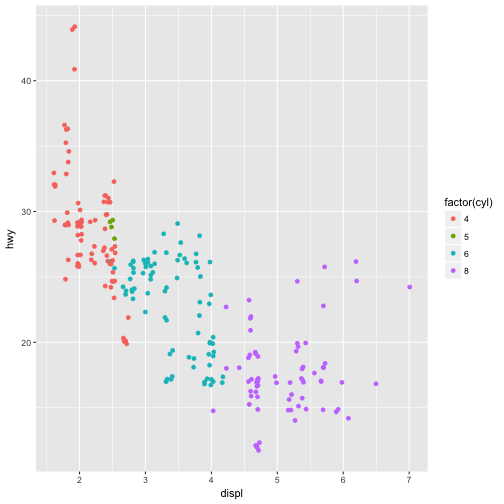
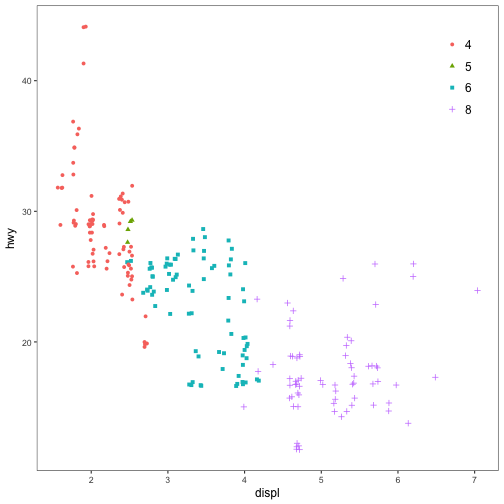

<!-- README.md is generated from README.Rmd. Please edit that file -->
jtools [](https://travis-ci.org/jacob-long/jtools) [](https://ci.appveyor.com/project/jacob-long/JTools) [](https://codecov.io/gh/jacob-long/jtools) [](https://opensource.org/licenses/MIT)
======================================================================================================================================================================================================================================================================================================================================================================================================================================================================================================================================================

This package consists of a series of functions created by the author (Jacob) to automate otherwise tedious research tasks. At this juncture, the unifying theme is the more efficient presentation of regression analyses, including those with interactions. Support for the `survey` package's `svyglm` objects is a common theme throughout.

Installation
------------

If you don't have `devtools` installed, first install it.

``` r
install.packages("devtools")
```

Then install the package from Github--it is not yet available from CRAN as it is in its early stages of development.

``` r
devtools::install_github("jacob-long/jtools")
```

Usage
-----

Here's a brief synopsis of the current functions in the package:

#### `j_summ()`

This is a replacement for `summary.lm` that provides the user several options for formatting regression summaries. Supports `glm` and `svyglm` objects as input as well, but it is not tested with nonlinear models. It supports calculation and reporting of robust standard errors via the `sandwich` and `lmtest` packages.

``` r
fit <- lm(mpg ~ hp*wt, data=mtcars)
j_summ(fit)
```

    #> MODEL INFO
    #> Sample Size: 32
    #> Dependent Variable: mpg
    #> Number of Predictors: 3
    #> 
    #> MODEL FIT: 
    #> F(3,28) = 71.66, p = 0
    #> R-squared = 0.885
    #> Adj. R-squared = 0.872
    #> 
    #> Standard errors: OLS 
    #>             Est.   S.E.  t val. p        
    #> (Intercept) 49.808 3.605 13.816 0     ***
    #> hp          -0.12  0.025 -4.863 0     ***
    #> wt          -8.217 1.27  -6.471 0     ***
    #> hp:wt       0.028  0.007 3.753  0.001 ***

#### `sim_slopes()`

This is an interface for simple slopes analysis for 2-way interactions. User can specify values of the moderator to test or use the default +/- 1 SD values.

``` r
sim_slopes(fit, pred="wt", modx = "hp")
```

    #> Slope of wt when hp = 215.25 (+1 SD): 
    #>   Est.   S.E.      p 
    #> -2.222  0.686  0.003 
    #> 
    #> Slope of wt when hp = 146.688 (Mean): 
    #>   Est.   S.E.      p 
    #> -4.132  0.530  0.000 
    #> 
    #> Slope of wt when hp = 78.125 (-1 SD): 
    #>   Est.   S.E.      p 
    #> -6.041  0.780  0.000

#### `interact_plot()`

This function plots two-way interactions using `ggplot2` with a similar interface to the aforementioned `sim_slopes()` function. Users can customize the appearance with familiar `ggplot2` commands. It supports several customizations, like confidence intervals.

``` r
interact_plot(fit, pred="wt", modx = "hp", interval = T, int.width = .95)
```


The function also supports categorical moderators and plotting observed data points alongside best-fitting lines.

``` r
fitiris <- lm(Petal.Length ~ Petal.Width*Species, data = iris)
interact_plot(fitiris, pred = "Petal.Width", modx = "Species", plot.points = TRUE)
```


#### `svycor()`

This function extends the `survey` package by calculating correlations with complex survey designs, a feature absent from `survey`. Users may request significance tests, which are calculated via bootstrap by calling the `weights` package.

``` r
library(survey)
data(api)
dstrat <- svydesign(id = ~1,strata = ~stype, weights = ~pw, data = apistrat, fpc=~fpc)

svycor(~api00+api99+dnum, design = dstrat, digits = 3, sig.stats = T, bootn = 2000)
```

    #>       api00  api99  dnum  
    #> api00 1      0.976* 0.254*
    #> api99 0.976* 1      0.244*
    #> dnum  0.254* 0.244* 1

#### `theme_apa()`

This will format your `ggplot2` graphics to make them (mostly) appropriate for APA style publications. There's no drop-in, perfect way to get plots into APA format sight unseen, but this gets you close and returns a `ggplot` object that can be further tweaked to your specification.

You might start with something like this:

``` r
library(ggplot2)
p <- ggplot(mpg, aes(displ, hwy)) + geom_point(aes(colour = factor(cyl)), position = "jitter")
p
```



And then use `theme_apa()` to tune it to APA specification. Note the `legend.pos` option:

``` r
p + theme_apa(legend.pos = "topright")
```


You may need to make further changes to please your publisher. For instance, if color graphics are not an option, you may want to use point shapes (notice the `aes(shape = )`) as an additional way to signal variation along the factor.

``` r
p <- ggplot(mpg, aes(displ, hwy)) + geom_point(aes(shape = factor(cyl), 
                                                   colour = factor(cyl)), 
                                               position = "jitter")
p + theme_apa(legend.pos = "topright") 
```



Details on the arguments can be accessed via the R documentation (`?functionname`). There are now vignettes documenting just about everything you can do as well.

Contributing
------------

I'm happy to receive bug reports, suggestions, questions, and (most of all) contributions to fix problems and add features. I prefer you use the Github issues system over trying to reach out to me in other ways. Pull requests for contributions are encouraged.

License
-------

The source code of this package is licensed under the [MIT License](http://opensource.org/licenses/mit-license.php).
