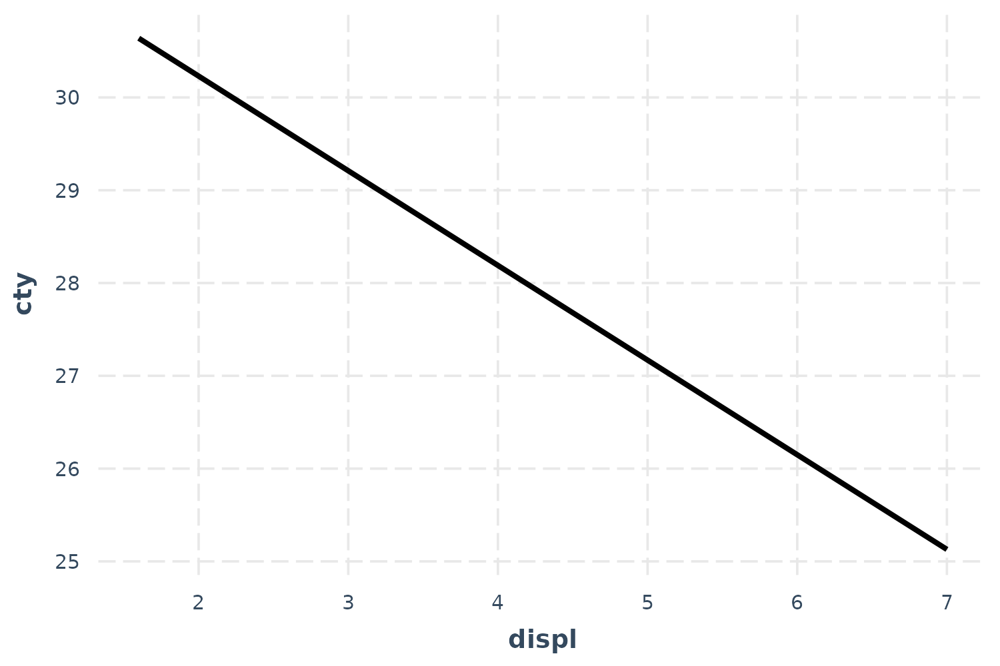
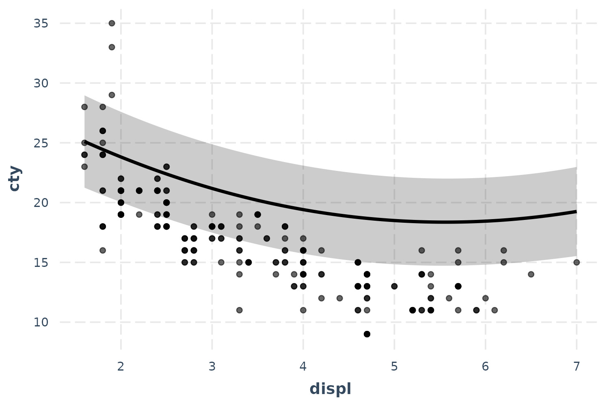
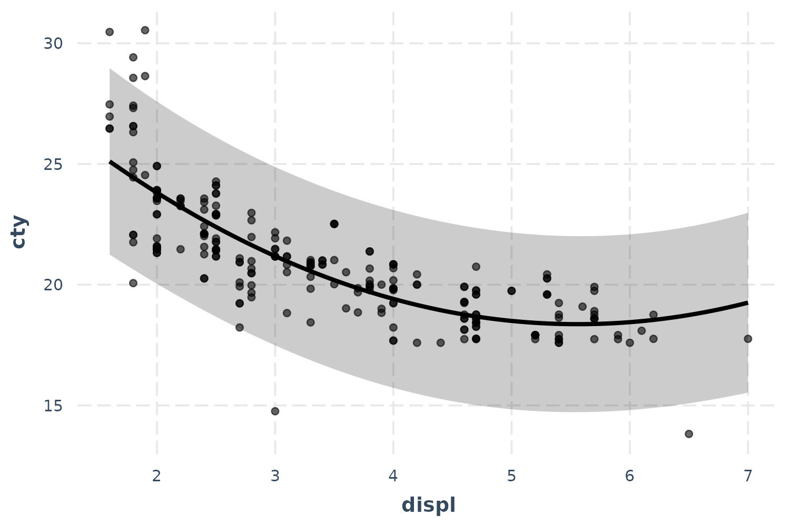
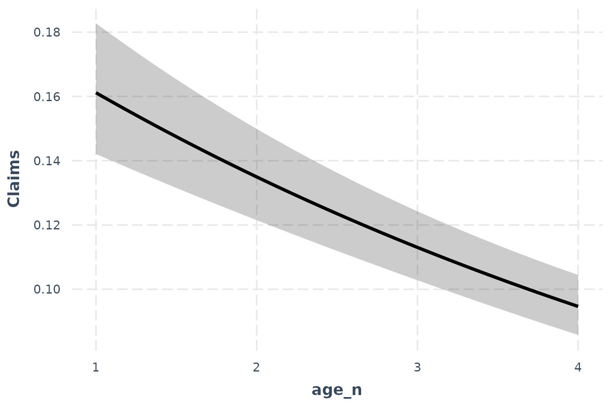
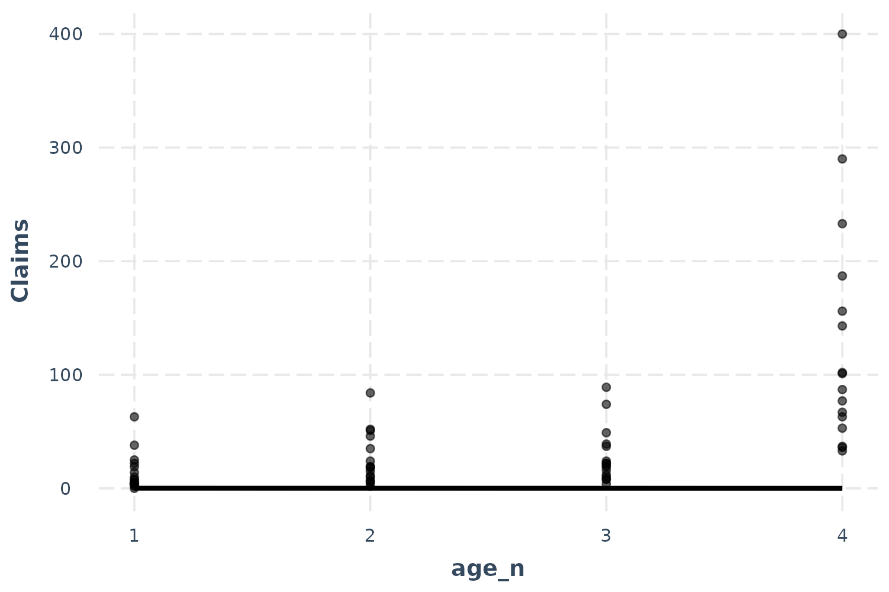
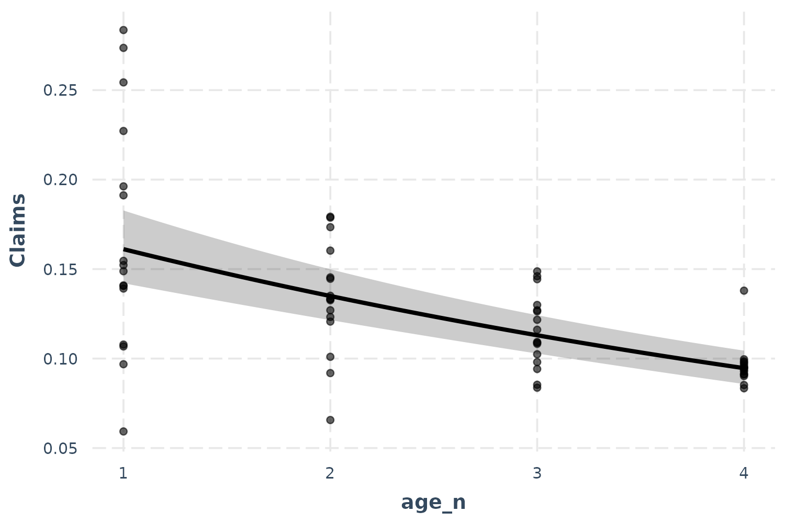
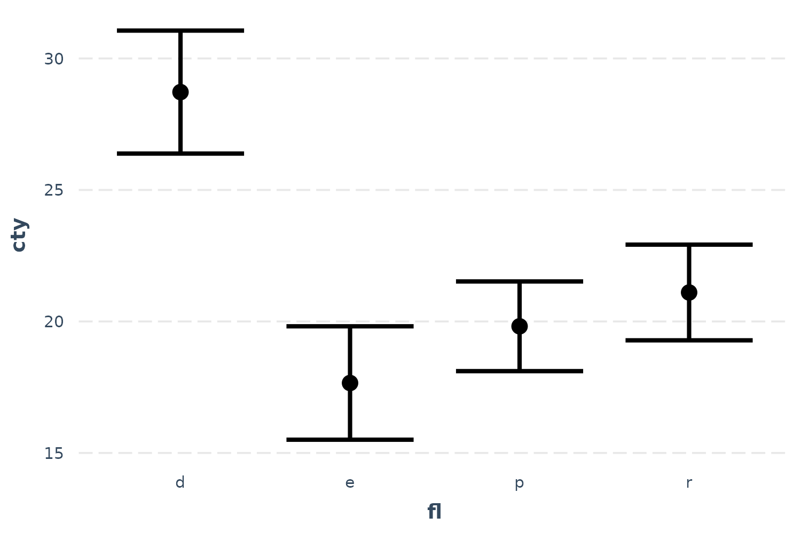
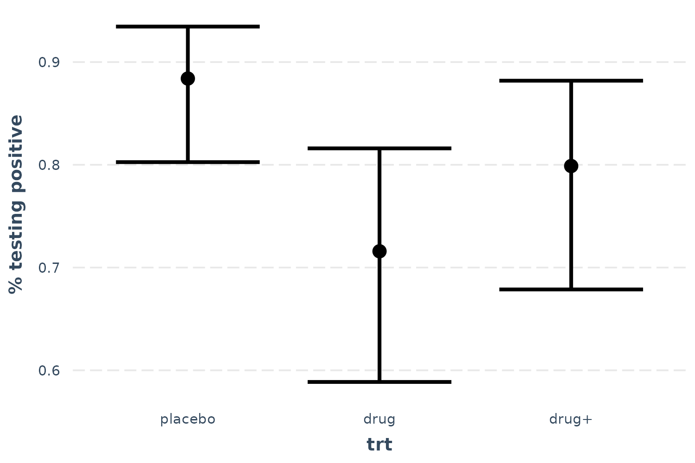
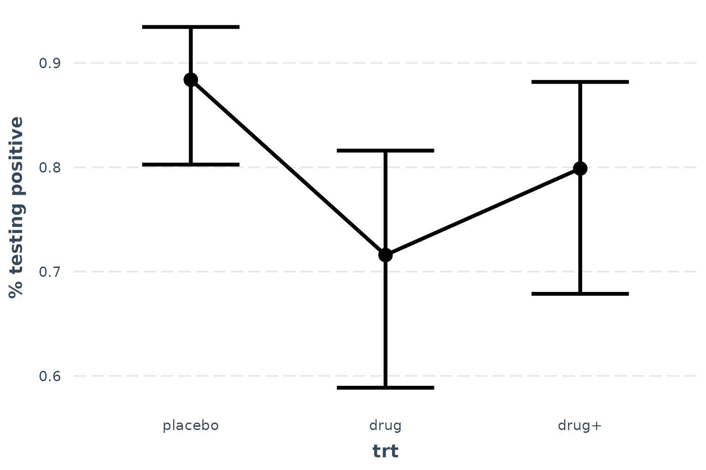

# Visualizing regression model predictions

One great way to understand what your regression model is telling you is
to look at what kinds of predictions it generates. The most
straightforward way to do so is to pick a predictor in the model and
calculate predicted values across values of that predictor, holding
everything else in the model equal. This is what Fox and Weisberg (2018)
call a “predictor effect display.”

## Linear model example

To illustrate, let’s create a model using the `mpg` data from the
`ggplot2` package. These data comprise information about 234 cars over
several years. We will be predicting the gas mileage in cities (`cty`)
using several variables, including engine displacement (`displ`), model
year (`year`), \# of engine cylinders (`cyl`), class of car (`class`),
and fuel type (`fl`).

Here’s a model summary courtesy of `summ`:

``` r
library(ggplot2)
data(mpg)
fit <- lm(cty ~ displ + year + cyl + class + fl, data = mpg[mpg$fl != "c",])
summ(fit)
```

    ## MODEL INFO:
    ## Observations: 233
    ## Dependent Variable: cty
    ## Type: OLS linear regression 
    ## 
    ## MODEL FIT:
    ## F(12,220) = 107.19, p = 0.00
    ## R² = 0.85
    ## Adj. R² = 0.85 
    ## 
    ## Standard errors:OLS
    ## -------------------------------------------------------
    ##                            Est.    S.E.   t val.      p
    ## --------------------- --------- ------- -------- ------
    ## (Intercept)             -193.86   50.92    -3.81   0.00
    ## displ                     -1.02    0.29    -3.53   0.00
    ## year                       0.12    0.03     4.52   0.00
    ## cyl                       -0.85    0.20    -4.26   0.00
    ## classcompact              -2.81    1.00    -2.83   0.01
    ## classmidsize              -2.95    0.97    -3.05   0.00
    ## classminivan              -5.08    1.05    -4.82   0.00
    ## classpickup               -5.89    0.92    -6.37   0.00
    ## classsubcompact           -2.63    1.01    -2.61   0.01
    ## classsuv                  -5.59    0.88    -6.33   0.00
    ## fle                      -11.06    0.99   -11.13   0.00
    ## flp                       -8.91    0.81   -11.03   0.00
    ## flr                       -7.62    0.77    -9.96   0.00
    ## -------------------------------------------------------

Let’s explore the effect of engine displacement on gas mileage:

``` r
effect_plot(fit, pred = displ)
```



To be clear, these predictions set all the continuous variables other
than `displ` to their mean value. This can be tweaked via the `centered`
argument (“none” or a vector of variables to center are options). Factor
variables are set to their base level and logical variables are set to
`FALSE`.

So this plot, in this case, is not *super* illuminating. Let’s see the
uncertainty around this line.

``` r
effect_plot(fit, pred = displ, interval = TRUE)
```


Now we’re getting somewhere.

If you want to get a feel for how the data are distributed, you can add
what is known as a rug plot.

``` r
effect_plot(fit, pred = displ, interval = TRUE, rug = TRUE)
```


For a more direct look at how the model relates to the observed data,
you can use the `plot.points = TRUE` argument.

``` r
effect_plot(fit, pred = displ, interval = TRUE, plot.points = TRUE)
```


Now we’re really learning something about our model—and things aren’t
looking great. It seems like a simple linear model may not even be
appropriate. Let’s try fitting a polynomial for the `displ` term to
capture that curvature.

``` r
fit_poly <- lm(cty ~ poly(displ, 2) + year + cyl + class + fl, data = mpg)
effect_plot(fit_poly, pred = displ, interval = TRUE, plot.points = TRUE)
```



Okay, now we’re getting closer even though the predicted line curiously
grazes over the top of most of the observed data. Before we panic, let’s
introduce another feature that might clear things up.

## Partial residuals plots

In complex regressions like the one in this running example, plotting
the observed data can sometimes be relatively uninformative because the
points seem to be all over the place. While the typical effects plot
shows predicted values of `cty` across different values of `displ`, I
included included a lot of predictors besides `displ` in this model and
they may be accounting for some of this variation. This is what *partial
residual plots* are designed to help with. Using the argument
`partial.residuals = TRUE`, what is plotted instead is the observed data
*with the effects of all the control variables accounted for*. In other
words, the value `cty` for the observed data is based only on the values
of `displ` and the model error. Let’s take a look.

``` r
effect_plot(fit_poly, pred = displ, interval = TRUE, partial.residuals = TRUE)
```



There we go! Our polynomial term for `displ` is looking much better now.
You could tell in the previous plot without partial residuals that the
*shape* of the predictions were about right, but the predicted line was
just too high. The partial residuals set all those controls to the same
value which shifted the observations up (in this case) to where the
predictions are. That means the model does a good job of explaining away
that discrepancy and we can see more clearly the polynomial term for
`displ` works better than a linear main effect.

You can learn more about the technique and theory in Fox and Weisberg
(2018). Another place to generate partial residual plots is in Fox’s
`effects` package.

## Generalized linear models

Plotting can be even more essential to understands models like GLMs
(e.g., logit, probit, poisson).

### Logit and probit

We’ll use the `bacteria` data from the `MASS` package to explore binary
dependent variable models. These data come from a study in which
children with a bacterial illness were provided with either an active
drug or placebo and some were given extra encouragement to take the
medicine by the doctor. These conditions are represented by the `trt`
variable. Patients were checked for presence or absence of the bacteria
(`y`) every few weeks (`week`).

``` r
library(MASS)
data(bacteria)
l_mod <- glm(y ~ trt + week, data = bacteria, family = binomial)
summ(l_mod)
```

    ## MODEL INFO:
    ## Observations: 220
    ## Dependent Variable: y
    ## Type: Generalized linear model
    ##   Family: binomial 
    ##   Link function: logit 
    ## 
    ## MODEL FIT:
    ## χ²(3) = 13.57, p = 0.00
    ## Pseudo-R² (Cragg-Uhler) = 0.10
    ## Pseudo-R² (McFadden) = 0.06
    ## AIC = 211.81, BIC = 225.38 
    ## 
    ## Standard errors:MLE
    ## ------------------------------------------------
    ##                      Est.   S.E.   z val.      p
    ## ----------------- ------- ------ -------- ------
    ## (Intercept)          2.55   0.41     6.28   0.00
    ## trtdrug             -1.11   0.43    -2.60   0.01
    ## trtdrug+            -0.65   0.45    -1.46   0.14
    ## week                -0.12   0.04    -2.62   0.01
    ## ------------------------------------------------

Let’s check out the effect of time.

``` r
effect_plot(l_mod, pred = week, interval = TRUE, y.label = "% testing positive")
```


As time goes on, fewer patients test positive for the bacteria.

### Poisson

For a poisson example, we’ll use the `Insurance` data from the `MASS`
package. We’re predicting the number of car insurance claims for people
with different combinations of car type, region, and age. While `Age` is
an ordered factor, I’ll convert it to a continuous variable for the sake
of demonstration. `Claims` is a count variable, so the poisson
distribution is an appropriate modeling approach.

``` r
library(MASS)
data(Insurance)
Insurance$age_n <- as.numeric(Insurance$Age)
p_mod <- glm(Claims ~ District + Group + age_n, data = Insurance,
             offset = log(Holders), family = poisson)
summ(p_mod)
```

    ## MODEL INFO:
    ## Observations: 64
    ## Dependent Variable: Claims
    ## Type: Generalized linear model
    ##   Family: poisson 
    ##   Link function: log 
    ## 
    ## MODEL FIT:
    ## χ²(7) = 184.71, p = 0.00
    ## Pseudo-R² (Cragg-Uhler) = 0.94
    ## Pseudo-R² (McFadden) = 0.33
    ## AIC = 384.87, BIC = 402.14 
    ## 
    ## Standard errors:MLE
    ## ------------------------------------------------
    ##                      Est.   S.E.   z val.      p
    ## ----------------- ------- ------ -------- ------
    ## (Intercept)         -1.37   0.07   -20.16   0.00
    ## District2            0.03   0.04     0.60   0.55
    ## District3            0.04   0.05     0.76   0.45
    ## District4            0.23   0.06     3.80   0.00
    ## Group.L              0.43   0.05     8.71   0.00
    ## Group.Q              0.00   0.04     0.11   0.91
    ## Group.C             -0.03   0.03    -0.88   0.38
    ## age_n               -0.18   0.02    -9.56   0.00
    ## ------------------------------------------------

Okay, age is a significant predictor of the number of claims. Note that
we have an offset term, so the count we’re predicting is more like a
*rate*. That is, we are modeling how many claims there are adjusting for
the amount of policyholders.

``` r
effect_plot(p_mod, pred = age_n, interval = TRUE)
```



So what does this mean? Critical is understanding the scale of the
outcome variable. Because of the offset, we must pick a value of the
offset to generate predictions at. `effect_plot`, by default, sets the
offset at 1. That means the predictions you see can be interpreted as a
percentage; for every policyholder, there are between 0.16 and 0.10
claims. We can also see that as age goes up, the proportion of
policyholders with claims goes down.

Now let’s take a look at the observed data…

``` r
effect_plot(p_mod, pred = age_n, interval = TRUE, plot.points = TRUE)
```



Oops! That doesn’t look right, does it? The problem here is the offset.
Some age groups have many more policyholders than others and they all
have more than 1, which is what we set the offset to for the
predictions. This is a more extreme version of the problem we had the
with the linear model previously, so let’s use the same solution:
partial residuals.

``` r
effect_plot(p_mod, pred = age_n, interval = TRUE, partial.residuals = TRUE)
```



Now we’re getting somewhere. The only difficulty in interpreting this is
the overlapping points. Let’s use the `jitter` argument to add a random
bit of noise to each observation so we can see just how many points
there are more clearly.

``` r
effect_plot(p_mod, pred = age_n, interval = TRUE, partial.residuals = TRUE,
            jitter = c(0.1, 0))
```


Because I didn’t want to alter the height of the points, I provided a
vector with both 0.1 (referring to the horizontal position) and 0
(referring to the vertical position) to the `jitter` argument.

## Categorical predictors

These methods don’t work as clearly when the predictor isn’t continuous.
Luckily, `effect_plot` automatically handles such cases and offers a
number of options for visualizing effects of categorical predictors.

Using our first example, predicting gas mileage, let’s focus on the
class of car as predictor.

``` r
effect_plot(fit, pred = fl, interval = TRUE)
```



We can clearly see how diesel (“d”) is associated with the best mileage
by far and ethanol (“e”) the worst by a little bit.

You can plot the observed data in these types of plots as well:

``` r
effect_plot(fit, pred = fl, interval = TRUE, plot.points = TRUE,
            jitter = .2)
```


These seem a bit far off from the predictions. Let’s see if the partial
residuals are a little more in line with expectations.

``` r
effect_plot(fit, pred = fl, interval = TRUE, partial.residuals = TRUE,
            jitter = .2)
```


Now things make a little more sense and you can see the range of
possibilities within each category after accounting for model year and
so on. Diesel in particular seems have too few and too spaced out
observations to take overly seriously.

Let’s also look at the bacteria example, using treatment type as the
predictor of interest.

``` r
effect_plot(l_mod, pred = trt, interval = TRUE, y.label = "% testing positive")
```



Now we can see that receiving the drug is clearly superior to placebo,
but the drug plus encouragement is not only no better than the drug
alone, it’s hardly better than placebo. Of course, we can also tell that
the confidence intervals are fairly wide, so I won’t say that these data
tell us anything definitively besides the superiority of the drug over
placebo.

You may also want to use lines to convey the ordered nature of this
predictor.

``` r
effect_plot(l_mod, pred = trt, interval = TRUE, y.label = "% testing positive",
            cat.geom = "line")
```


