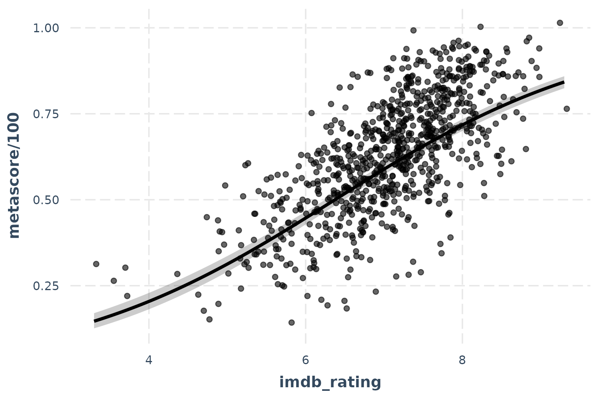

# Tools for summarizing and visualizing regression models

The support `jtools` provides for helping to understand and report the
results of regression models falls into a few broad categories:

- Generating flexible table output in the console that includes multiple
  standard error specifications, toggles for confidence intervals, VIFs,
  p values, and so on (`summ`)
- Plotting predicted data from models to aid in substantive
  interpretation and understanding model fit, including models with
  interactions (`effect_plot`; see other vignette)
- Plotting regression coefficients and their uncertainty in a visually
  appealing way (`plot_coefs`, `plot_summs`)
- Exporting regression summaries as tables in PDF/LaTeX and Word formats
  for publication (`export_summs`)

## `summ`

When sharing analyses with colleagues unfamiliar with R, I found that
the output generally was not clear to them. Things were even worse if I
wanted to give them information that is not included in the
[`summary()`](https://rdrr.io/r/base/summary.html) like robust standard
errors, scaled coefficients, and VIFs since the functions for estimating
these don’t append them to a typical regression table. After creating
output tables “by hand” on multiple occasions, I thought it would be
best to pack things into a reusable function: It became
[`summ()`](../reference/summ.md).

For example purposes, we’ll create a model using the `movies` data from
this package. These data comprise information about over 800 movies
across several decades. We will be predicting the Metacritic
`metascore`, which ranges from 0 to 100 (where higher numbers reflect
more positive reviews) using the gross revenue in the United States
(`us_gross`), the fan rating at IMDB (`imdb_rating`), and a categorical
variable reflecting the genre (`genre5`) with “Action” as the reference
level.

With no user-specified arguments except a fitted model, the output of
[`summ()`](../reference/summ.md) looks like this:

``` r
library(jtools) # Load jtools
data(movies) # Telling R we want to use this data
fit <- lm(metascore ~ imdb_rating + log(us_gross) + genre5, data = movies)
summ(fit)
```

    ## MODEL INFO:
    ## Observations: 831 (10 missing obs. deleted)
    ## Dependent Variable: metascore
    ## Type: OLS linear regression 
    ## 
    ## MODEL FIT:
    ## F(6,824) = 169.37, p = 0.00
    ## R² = 0.55
    ## Adj. R² = 0.55 
    ## 
    ## Standard errors:OLS
    ## -----------------------------------------------------------
    ##                                 Est.   S.E.   t val.      p
    ## --------------------------- -------- ------ -------- ------
    ## (Intercept)                   -39.96   5.92    -6.75   0.00
    ## imdb_rating                    12.80   0.49    25.89   0.00
    ## log(us_gross)                   0.47   0.31     1.52   0.13
    ## genre5Comedy                    6.32   1.06     5.95   0.00
    ## genre5Drama                     7.66   1.08     7.12   0.00
    ## genre5Horror/Thriller          -0.73   1.51    -0.48   0.63
    ## genre5Other                     5.86   3.25     1.80   0.07
    ## -----------------------------------------------------------

Like any output, this one is somewhat opinionated — some information is
shown that perhaps not everyone would be interested in, some may be
missing. That, of course, was the motivation behind the creation of the
function; I didn’t like the choices made by R’s core team with
[`summary()`](https://rdrr.io/r/base/summary.html)!

Here’s a quick (not comprehensive) list of functionality supported by
`summ`:

- Summaries for `lm`, `glm`, `svyglm` (`survey`), `merMod` (`lme4`), and
  `rq` (`quantreg`) models.
- Variable scaling and centering (i.e., calculating standardized
  coefficients)
- Robust standard errors (for `lm` and `glm` plus `quantreg`’s built-in
  options for `rq` models)
- Confidence intervals, VIFs, and partial correlations (`lm` only) can
  optionally be included in the output
- p-values can be dropped from the output
- R^2 (`lm`, linear `svyglm`), pseudo-R^2 (`glm`, `svyglm`, `merMod`),
  R^1 (`rq`), and other model fit statistics are calculated and
  reported. These can also be suppressed if you don’t want them.
- Ability to choose defaults for many options using
  [`set_summ_defaults()`](../reference/set_summ_defaults.md) to reduce
  the need to do redundant typing in interactive use.

Model types supported are `lm`, `glm`, `svyglm`, `merMod`, and `rq`,
though not all will be reviewed in detail here.

**Note:** The output in this vignette will mimic how it looks in the R
console, but if you are generating your own RMarkdown documents and have
`kableExtra` installed, you’ll instead get some prettier looking tables
like this:

``` r
summ(fit)
```

|                    |                               |
|:-------------------|------------------------------:|
| Observations       | 831 (10 missing obs. deleted) |
| Dependent variable |                     metascore |
| Type               |         OLS linear regression |

|          |        |
|:---------|-------:|
| F(6,824) | 169.37 |
| R²       |   0.55 |
| Adj. R²  |   0.55 |

|                       |   Est. | S.E. | t val. |    p |
|:----------------------|-------:|-----:|-------:|-----:|
| (Intercept)           | -39.96 | 5.92 |  -6.75 | 0.00 |
| imdb_rating           |  12.80 | 0.49 |  25.89 | 0.00 |
| log(us_gross)         |   0.47 | 0.31 |   1.52 | 0.13 |
| genre5Comedy          |   6.32 | 1.06 |   5.95 | 0.00 |
| genre5Drama           |   7.66 | 1.08 |   7.12 | 0.00 |
| genre5Horror/Thriller |  -0.73 | 1.51 |  -0.48 | 0.63 |
| genre5Other           |   5.86 | 3.25 |   1.80 | 0.07 |
|  Standard errors: OLS |        |      |        |      |

You can force `knitr` to give the console style of output by setting the
chunk option `render = 'normal_print'`.

### Report robust standard errors

One of the problems that originally motivated the creation of
[`summ()`](../reference/summ.md) was the desire to efficiently report
robust standard errors — while it is easy enough for an experienced R
user to calculate robust standard errors, there are not many simple ways
to include the results in a regression table as is common with the likes
of Stata, SPSS, etc.

Robust standard errors require the user to have the `sandwich` package
installed. It does not need to be loaded.

There are multiple types of robust standard errors that you may use,
ranging from “HC0” to “HC5”. Per the recommendation of the authors of
the `sandwich` package, the default is “HC3” so this is what you get if
you set `robust = TRUE`. Stata’s default is “HC1”, so you may want to
use that if your goal is to replicate Stata analyses. To toggle the type
of robust errors, provide the desired type as the argument to `robust`.

``` r
summ(fit, robust = "HC1")
```

    ## MODEL INFO:
    ## Observations: 831 (10 missing obs. deleted)
    ## Dependent Variable: metascore
    ## Type: OLS linear regression 
    ## 
    ## MODEL FIT:
    ## F(6,824) = 169.37, p = 0.00
    ## R² = 0.55
    ## Adj. R² = 0.55 
    ## 
    ## Standard errors: Robust, type = HC1
    ## -----------------------------------------------------------
    ##                                 Est.   S.E.   t val.      p
    ## --------------------------- -------- ------ -------- ------
    ## (Intercept)                   -39.96   6.16    -6.48   0.00
    ## imdb_rating                    12.80   0.48    26.42   0.00
    ## log(us_gross)                   0.47   0.33     1.39   0.16
    ## genre5Comedy                    6.32   1.01     6.24   0.00
    ## genre5Drama                     7.66   1.11     6.92   0.00
    ## genre5Horror/Thriller          -0.73   1.59    -0.46   0.65
    ## genre5Other                     5.86   3.24     1.81   0.07
    ## -----------------------------------------------------------

Robust standard errors can also be calculated for generalized linear
models (i.e., `glm` objects) though there is some debate whether they
should be used for models fit iteratively with non-normal errors. In the
case of `svyglm`, the standard errors that package calculates are
already robust to heteroskedasticity, so any argument to `robust` will
be ignored with a warning.

You may also specify with `cluster` argument the name of a variable in
the input data or a vector of clusters to get cluster-robust standard
errors.

### Standardized/scaled coefficients

Some prefer to use scaled coefficients in order to avoid dismissing an
effect as “small” when it is just the units of measure that are small.
scaled betas are used instead when `scale = TRUE`. To be clear, since
the meaning of “standardized beta” can vary depending on who you talk
to, this option mean-centers the predictors as well but does not alter
the dependent variable whatsoever. If you want to scale the dependent
variable too, just add the `transform.response = TRUE` argument. This
argument does not do anything to factor variables and doesn’t scale
binary variables by default.

``` r
summ(fit, scale = TRUE)
```

    ## MODEL INFO:
    ## Observations: 831 (10 missing obs. deleted)
    ## Dependent Variable: metascore
    ## Type: OLS linear regression 
    ## 
    ## MODEL FIT:
    ## F(6,824) = 169.37, p = 0.00
    ## R² = 0.55
    ## Adj. R² = 0.55 
    ## 
    ## Standard errors:OLS
    ## ----------------------------------------------------------
    ##                                Est.   S.E.   t val.      p
    ## --------------------------- ------- ------ -------- ------
    ## (Intercept)                   58.74   0.75    78.51   0.00
    ## imdb_rating                   11.06   0.43    25.89   0.00
    ## log(us_gross)                  0.63   0.42     1.52   0.13
    ## genre5Comedy                   6.32   1.06     5.95   0.00
    ## genre5Drama                    7.66   1.08     7.12   0.00
    ## genre5Horror/Thriller         -0.73   1.51    -0.48   0.63
    ## genre5Other                    5.86   3.25     1.80   0.07
    ## ----------------------------------------------------------
    ## 
    ## Continuous predictors are mean-centered and scaled by 1 s.d. The outcome variable remains in its original units.

If you have transformed variables (e.g., `log(us_gross)`), the function
will scale the already-transformed variable. In other words, it is
similar to the result you would get if you did `scale(log(us_gross))`
rather than `log(scale(us_gross))` which would cause an error since you
cannot apply [`log()`](https://rdrr.io/r/base/Log.html) to numbers \<==
0.

You can also choose a different number of standard deviations to divide
by for standardization. [Andrew
Gelman](https://sites.stat.columbia.edu/gelman/research/published/standardizing7.pdf)
has been a proponent of dividing by 2 standard deviations; if you want
to do things that way, give the argument `n.sd = 2`.

``` r
summ(fit, scale = TRUE, n.sd = 2)
```

    ## MODEL INFO:
    ## Observations: 831 (10 missing obs. deleted)
    ## Dependent Variable: metascore
    ## Type: OLS linear regression 
    ## 
    ## MODEL FIT:
    ## F(6,824) = 169.37, p = 0.00
    ## R² = 0.55
    ## Adj. R² = 0.55 
    ## 
    ## Standard errors:OLS
    ## ----------------------------------------------------------
    ##                                Est.   S.E.   t val.      p
    ## --------------------------- ------- ------ -------- ------
    ## (Intercept)                   58.74   0.75    78.51   0.00
    ## imdb_rating                   22.12   0.85    25.89   0.00
    ## log(us_gross)                  1.26   0.83     1.52   0.13
    ## genre5Comedy                   6.32   1.06     5.95   0.00
    ## genre5Drama                    7.66   1.08     7.12   0.00
    ## genre5Horror/Thriller         -0.73   1.51    -0.48   0.63
    ## genre5Other                    5.86   3.25     1.80   0.07
    ## ----------------------------------------------------------
    ## 
    ## Continuous predictors are mean-centered and scaled by 2 s.d. The outcome variable remains in its original units.

Note that this is achieved by refitting the model. If the model took a
long time to fit initially, expect a similarly long time to refit it.

#### Mean-centered variables

In the same vein as the standardization feature, you can keep the
original scale while still mean-centering the predictors with the
`center = TRUE` argument. As with `scale`, this is not applied to the
response variable unless `transform.response = TRUE`.

``` r
summ(fit, center = TRUE)
```

    ## MODEL INFO:
    ## Observations: 831 (10 missing obs. deleted)
    ## Dependent Variable: metascore
    ## Type: OLS linear regression 
    ## 
    ## MODEL FIT:
    ## F(6,824) = 169.37, p = 0.00
    ## R² = 0.55
    ## Adj. R² = 0.55 
    ## 
    ## Standard errors:OLS
    ## ----------------------------------------------------------
    ##                                Est.   S.E.   t val.      p
    ## --------------------------- ------- ------ -------- ------
    ## (Intercept)                   58.74   0.75    78.51   0.00
    ## imdb_rating                   12.80   0.49    25.89   0.00
    ## log(us_gross)                  0.47   0.31     1.52   0.13
    ## genre5Comedy                   6.32   1.06     5.95   0.00
    ## genre5Drama                    7.66   1.08     7.12   0.00
    ## genre5Horror/Thriller         -0.73   1.51    -0.48   0.63
    ## genre5Other                    5.86   3.25     1.80   0.07
    ## ----------------------------------------------------------
    ## 
    ## Continuous predictors are mean-centered. The outcome variable remains in its original units.

### Confidence intervals

In many cases, you’ll learn more by looking at confidence intervals than
p-values. You can request them from `summ`.

``` r
summ(fit, confint = TRUE, digits = 3)
```

    ## MODEL INFO:
    ## Observations: 831 (10 missing obs. deleted)
    ## Dependent Variable: metascore
    ## Type: OLS linear regression 
    ## 
    ## MODEL FIT:
    ## F(6,824) = 169.367, p = 0.000
    ## R² = 0.552
    ## Adj. R² = 0.549 
    ## 
    ## Standard errors:OLS
    ## --------------------------------------------------------------------------
    ##                                  Est.      2.5%     97.5%   t val.       p
    ## --------------------------- --------- --------- --------- -------- -------
    ## (Intercept)                   -39.959   -51.579   -28.338   -6.750   0.000
    ## imdb_rating                    12.801    11.831    13.772   25.886   0.000
    ## log(us_gross)                   0.466    -0.136     1.069    1.519   0.129
    ## genre5Comedy                    6.321     4.235     8.406    5.949   0.000
    ## genre5Drama                     7.660     5.547     9.773    7.117   0.000
    ## genre5Horror/Thriller          -0.730    -3.696     2.236   -0.483   0.629
    ## genre5Other                     5.860    -0.519    12.239    1.803   0.072
    ## --------------------------------------------------------------------------

You can adjust the width of the confidence intervals, which are by
default 95% CIs.

``` r
summ(fit, confint = TRUE, ci.width = .5)
```

    ## MODEL INFO:
    ## Observations: 831 (10 missing obs. deleted)
    ## Dependent Variable: metascore
    ## Type: OLS linear regression 
    ## 
    ## MODEL FIT:
    ## F(6,824) = 169.37, p = 0.00
    ## R² = 0.55
    ## Adj. R² = 0.55 
    ## 
    ## Standard errors:OLS
    ## ----------------------------------------------------------------------
    ##                                 Est.      25%      75%   t val.      p
    ## --------------------------- -------- -------- -------- -------- ------
    ## (Intercept)                   -39.96   -43.95   -35.96    -6.75   0.00
    ## imdb_rating                    12.80    12.47    13.14    25.89   0.00
    ## log(us_gross)                   0.47     0.26     0.67     1.52   0.13
    ## genre5Comedy                    6.32     5.60     7.04     5.95   0.00
    ## genre5Drama                     7.66     6.93     8.39     7.12   0.00
    ## genre5Horror/Thriller          -0.73    -1.75     0.29    -0.48   0.63
    ## genre5Other                     5.86     3.67     8.05     1.80   0.07
    ## ----------------------------------------------------------------------

### Removing p values

You might also want to drop the p-values altogether.

``` r
summ(fit, confint = TRUE, pvals = FALSE)
```

    ## MODEL INFO:
    ## Observations: 831 (10 missing obs. deleted)
    ## Dependent Variable: metascore
    ## Type: OLS linear regression 
    ## 
    ## MODEL FIT:
    ## F(6,824) = 169.37, p = 0.00
    ## R² = 0.55
    ## Adj. R² = 0.55 
    ## 
    ## Standard errors:OLS
    ## ---------------------------------------------------------------
    ##                                 Est.     2.5%    97.5%   t val.
    ## --------------------------- -------- -------- -------- --------
    ## (Intercept)                   -39.96   -51.58   -28.34    -6.75
    ## imdb_rating                    12.80    11.83    13.77    25.89
    ## log(us_gross)                   0.47    -0.14     1.07     1.52
    ## genre5Comedy                    6.32     4.24     8.41     5.95
    ## genre5Drama                     7.66     5.55     9.77     7.12
    ## genre5Horror/Thriller          -0.73    -3.70     2.24    -0.48
    ## genre5Other                     5.86    -0.52    12.24     1.80
    ## ---------------------------------------------------------------

Remember that you can omit p-values regardless of whether you have
requested confidence intervals.

### Generalized and Mixed models

`summ` has been expanding its range of supported model types. `glm`
models are a straightforward choice. Here we can take our previous
model, but make it a probit model to reflect the fact that `metascore`
is bound at 0 and 100 (analogous to 0 and 1). We’ll use the
`quasibinomial` family since this is a percentage rather a binary
outcome.

``` r
fitg <- glm(metascore/100 ~ imdb_rating + log(us_gross) + genre5, data = movies,
            family = quasibinomial())

summ(fitg)
```

    ## MODEL INFO:
    ## Observations: 831 (10 missing obs. deleted)
    ## Dependent Variable: metascore/100
    ## Type: Generalized linear model
    ##   Family: quasibinomial 
    ##   Link function: logit 
    ## 
    ## MODEL FIT:
    ## χ²(6) = 57.19, p = 0.00
    ## Pseudo-R² (Cragg-Uhler) = 0.28
    ## Pseudo-R² (McFadden) = 0.18
    ## AIC =  NA, BIC =  NA 
    ## 
    ## Standard errors:MLE
    ## ----------------------------------------------------------
    ##                                Est.   S.E.   t val.      p
    ## --------------------------- ------- ------ -------- ------
    ## (Intercept)                   -4.14   0.28   -14.81   0.00
    ## imdb_rating                    0.57   0.02    24.27   0.00
    ## log(us_gross)                  0.03   0.01     1.86   0.06
    ## genre5Comedy                   0.27   0.05     5.67   0.00
    ## genre5Drama                    0.35   0.05     7.11   0.00
    ## genre5Horror/Thriller         -0.02   0.07    -0.36   0.72
    ## genre5Other                    0.24   0.15     1.58   0.12
    ## ----------------------------------------------------------
    ## 
    ## Estimated dispersion parameter = 0.06

For exponential family models, especially logit and Poisson, you may be
interested in getting the exponentiated coefficients rather than the
linear estimates. `summ` can handle that!

``` r
summ(fitg, exp = TRUE)
```

    ## MODEL INFO:
    ## Observations: 831 (10 missing obs. deleted)
    ## Dependent Variable: metascore/100
    ## Type: Generalized linear model
    ##   Family: quasibinomial 
    ##   Link function: logit 
    ## 
    ## MODEL FIT:
    ## χ²(6) = 57.19, p = 0.00
    ## Pseudo-R² (Cragg-Uhler) = 0.28
    ## Pseudo-R² (McFadden) = 0.18
    ## AIC =  NA, BIC =  NA 
    ## 
    ## Standard errors:MLE
    ## ----------------------------------------------------------------------
    ##                               exp(Est.)   2.5%   97.5%   t val.      p
    ## --------------------------- ----------- ------ ------- -------- ------
    ## (Intercept)                        0.02   0.01    0.03   -14.81   0.00
    ## imdb_rating                        1.77   1.69    1.86    24.27   0.00
    ## log(us_gross)                      1.03   1.00    1.06     1.86   0.06
    ## genre5Comedy                       1.31   1.20    1.44     5.67   0.00
    ## genre5Drama                        1.42   1.29    1.57     7.11   0.00
    ## genre5Horror/Thriller              0.98   0.85    1.11    -0.36   0.72
    ## genre5Other                        1.27   0.94    1.72     1.58   0.12
    ## ----------------------------------------------------------------------
    ## 
    ## Estimated dispersion parameter = 0.06

Standard errors are omitted for odds ratio estimates since the
confidence intervals are not symmetrical.

You can also get summaries of `merMod` objects, the mixed models from
the `lme4` package.

``` r
library(lme4)
fm1 <- lmer(Reaction ~ Days + (Days | Subject), sleepstudy)

summ(fm1)
```

    ## MODEL INFO:
    ## Observations: 180
    ## Dependent Variable: Reaction
    ## Type: Mixed effects linear regression 
    ## 
    ## MODEL FIT:
    ## AIC = 1755.63, BIC = 1774.79
    ## Pseudo-R² (fixed effects) = 0.28
    ## Pseudo-R² (total) = 0.80 
    ## 
    ## FIXED EFFECTS:
    ## ---------------------------------------------------------
    ##                       Est.   S.E.   t val.    d.f.      p
    ## ----------------- -------- ------ -------- ------- ------
    ## (Intercept)         251.41   6.82    36.84   17.00   0.00
    ## Days                 10.47   1.55     6.77   17.00   0.00
    ## ---------------------------------------------------------
    ## 
    ## p values calculated using Satterthwaite d.f.
    ## 
    ## RANDOM EFFECTS:
    ## ------------------------------------
    ##   Group      Parameter    Std. Dev. 
    ## ---------- ------------- -----------
    ##  Subject    (Intercept)     24.74   
    ##  Subject       Days         5.92    
    ##  Residual                   25.59   
    ## ------------------------------------
    ## 
    ## Grouping variables:
    ## ---------------------------
    ##   Group    # groups   ICC  
    ## --------- ---------- ------
    ##  Subject      18      0.48 
    ## ---------------------------

Note that the summary of linear mixed models will omit p-values by
default unless the package is installed for linear models. There’s no
clear-cut way to derive p-values with linear mixed models and treating
the t-values as you would for OLS models can lead to inflated Type 1
error rates. Confidence intervals are better, but not perfect.
Kenward-Roger calculated degrees of freedom are fairly good under many
circumstances and those are used by default when package is installed.
Be aware that for larger datasets, this procedure can take a long time.
See the documentation ([`?summ.merMod`](../reference/summ.merMod.md))
for more info.

You also get an estimated model R-squared for mixed models using the
Nakagawa & Schielzeth (2013) procedure with code adapted from the
`piecewiseSEM` package.

#### svyglm

I won’t run through any examples here, but `svyglm` models are supported
and provide near-equivalent output to what you see here depending on
whether they are linear models or generalized linear models. See
[`?summ.svyglm`](../reference/summ.svyglm.md) for details.

#### Quantile regression

[`summ()`](../reference/summ.md) also supports quantile regression
models, as estimated by the `rq` package. See
[`?summ.rq`](../reference/summ.rq.md) for details.

## `effect_plot()`

Sometimes to really understand what your model is telling you, you need
to see the kind of predictions it will give you. For that, you can use
[`effect_plot()`](../reference/effect_plot.md), which does what it
sounds like. There is a separate vignette available to explore all it
can offer, but here’s a basic example with our `glm` model:

``` r
effect_plot(fitg, pred = imdb_rating, interval = TRUE, plot.points = TRUE, 
            jitter = 0.05)
```



Now we’re really learning something about our model—and you can see the
close but imperfect agreement between fans and critics.

## `plot_summs()` and `plot_coefs()`

When it comes time to share your findings, especially in talks, tables
are often not the best way to capture people’s attention and quickly
convey the results. Variants on what are known by some as “forest plots”
have been gaining popularity for presenting regression results.

For that, `jtools` provides [`plot_summs()`](../reference/plot_summs.md)
and [`plot_coefs()`](../reference/plot_summs.md).
[`plot_summs()`](../reference/plot_summs.md) gives you a plotting
interface to [`summ()`](../reference/summ.md) and allows you to do so
with multiple models simultaneously (assuming you want to apply the same
arguments to each model).

Here’s a basic, single-model use case.

``` r
plot_summs(fit)
```


Note that the intercept is omitted by default because it often distorts
the scale and generally isn’t of theoretical interest. You can change
this behavior or omit other coefficients with the `omit.coefs` argument.

We may still want to use other features of
[`summ()`](../reference/summ.md), like having robust standard errors. No
problem.

``` r
plot_summs(fit, robust = TRUE)
```


Note that by default the width of the confidence interval is .95, but
this can be changed with the `ci_level` argument. You can also add a
thicker band to convey a narrow interval using the `inner_ci_level`
argument:

``` r
plot_summs(fit, inner_ci_level = .9)
```


#### Plot coefficient uncertainty as normal distributions

Most of our commonly used regression models make an assumption that the
coefficient estimates are asymptotically normally distributed, which is
how we derive our confidence intervals, p values, and so on. Using the
`plot.distributions = TRUE` argument, you can plot a normal distribution
along the width of your specified interval to convey the uncertainty.
This is also great for didactic purposes.

While the common OLS model assumes a *t* distribution, I decided that
they are visually sufficiently close that I have opted not to try to
plot the points along a *t* distribution.

``` r
plot_summs(fit, plot.distributions = TRUE, inner_ci_level = .9)
```


#### Comparing model coefficients visually

Comparison of multiple models simultaneously is another benefit of
plotting. This is especially true when the models are nested. Let’s fit
a second model and compare.

``` r
fit2 <- lm(metascore ~ imdb_rating + log(us_gross) + log(budget) + genre5,
           data = movies)
plot_summs(fit, fit2)
```


Doing this with `plot.distributions = TRUE` creates a nice effect:

``` r
plot_summs(fit, fit2, plot.distributions = TRUE)
```


By providing a list of [`summ()`](../reference/summ.md) arguments to
[`plot_summs()`](../reference/plot_summs.md), you can compare results
with different [`summ()`](../reference/summ.md) arguments (each item in
the list corresponds to one model; the second list item to the second
model, etc.). For instance, we can look at how the standard errors
differ with different `robust` arguments:

``` r
plot_summs(fit, fit, fit, robust = list(FALSE, "HC0", "HC5"),
           model.names = c("OLS", "HC0", "HC5"))
```


#### Support for models with no `summ()` method

[`plot_coefs()`](../reference/plot_summs.md) is very similar to
[`plot_summs()`](../reference/plot_summs.md), but does not offer the
features that [`summ()`](../reference/summ.md) does. The tradeoff,
though, is that it allows for model types that
[`summ()`](../reference/summ.md) does not — any model supported by
[`tidy()`](https://generics.r-lib.org/reference/tidy.html) from the
`broom` or `broom.mixed` packages should work.

Note: If you provide unsupported model types to
[`plot_summs()`](../reference/plot_summs.md), it just passes them to
[`plot_coefs()`](../reference/plot_summs.md).

## Table output for Word and RMarkdown documents

Sometimes you really do want a table, but it can’t be standard R output.
For that, you can use [`export_summs()`](../reference/export_summs.md).
It is a wrapper around `huxtable`’s `huxreg()` function that will give
you nice looking output if used in RMarkdown documents or, if requested,
printed to a Word file. In the latter case, complicated models often
need more fine-tuning in Word, but it gets you started.

Like [`plot_summs()`](../reference/plot_summs.md),
[`export_summs()`](../reference/export_summs.md) is designed to give you
the features available in [`summ()`](../reference/summ.md), so you can
request things like robust standard errors and variable scaling.

Here’s an example of what to expect in a document like this one:

``` r
export_summs(fit, fit2, scale = TRUE)
```

|                                                                                                                                                                                 |      Model 1 |      Model 2 |
|---------------------------------------------------------------------------------------------------------------------------------------------------------------------------------|-------------:|-------------:|
| (Intercept)                                                                                                                                                                     | 58.74 \*\*\* | 59.63 \*\*\* |
|                                                                                                                                                                                 |    (0.75)    |    (0.76)    |
| imdb_rating                                                                                                                                                                     | 11.06 \*\*\* | 10.61 \*\*\* |
|                                                                                                                                                                                 |    (0.43)    |    (0.43)    |
| `log(us_gross)`                                                                                                                                                                 |     0.63     |  2.17 \*\*\* |
|                                                                                                                                                                                 |    (0.42)    |    (0.51)    |
| genre5Comedy                                                                                                                                                                    |  6.32 \*\*\* |  4.84 \*\*\* |
|                                                                                                                                                                                 |    (1.06)    |    (1.09)    |
| genre5Drama                                                                                                                                                                     |  7.66 \*\*\* |  6.71 \*\*\* |
|                                                                                                                                                                                 |    (1.08)    |    (1.08)    |
| genre5Horror/Thriller                                                                                                                                                           |    -0.73     |    -2.81     |
|                                                                                                                                                                                 |    (1.51)    |    (1.55)    |
| genre5Other                                                                                                                                                                     |     5.86     |    6.30 \*   |
|                                                                                                                                                                                 |    (3.25)    |    (3.20)    |
| `log(budget)`                                                                                                                                                                   |              | -2.64 \*\*\* |
|                                                                                                                                                                                 |              |    (0.53)    |
| N                                                                                                                                                                               |   831        |   831        |
| R2                                                                                                                                                                              |     0.55     |     0.57     |
| All continuous predictors are mean-centered and scaled by 1 standard deviation. The outcome variable is in its original units. \*\*\* p \< 0.001; \*\* p \< 0.01; \* p \< 0.05. |              |              |

When using RMarkdown, set `results = 'asis'` for the chunk with
[`export_summs()`](../reference/export_summs.md) to get the right
formatting for whatever type of output document (HTML, PDF, etc.)

To format the error statistics, simply put the statistics desired in
curly braces wherever you want them in a character string. For example,
if you want the standard error in parentheses, the argument would be
`"({std.error})"`, which is the default. Some other ideas:

- `"({statistic})"`, which gives you the test statistic in parentheses.

- `"({statistic}, p = {p.value})"`, which gives the test statistic
  followed by a “p =” p value all in parentheses. Note that you’ll have
  to pay special attention to rounding if you do this to keep cells
  sufficiently narrow.

- `"[{conf.low}, {conf.high}]"`, which gives the confidence interval in
  the standard bracket notation. You could also explicitly write the
  confidence level, e.g., `"95% CI [{conf.low}, {conf.high}]"`.

Here’s an example with confidence intervals instead of standard errors:

``` r
export_summs(fit, fit2, scale = TRUE,
             error_format = "[{conf.low}, {conf.high}]")
```

|                                                                                                                                                                                 |             Model 1 |             Model 2 |
|---------------------------------------------------------------------------------------------------------------------------------------------------------------------------------|--------------------:|--------------------:|
| (Intercept)                                                                                                                                                                     |        58.74 \*\*\* |        59.63 \*\*\* |
|                                                                                                                                                                                 | \[57.27, 60.21\]    | \[58.15, 61.12\]    |
| imdb_rating                                                                                                                                                                     |        11.06 \*\*\* |        10.61 \*\*\* |
|                                                                                                                                                                                 | \[10.22, 11.90\]    |  \[9.76, 11.45\]    |
| `log(us_gross)`                                                                                                                                                                 |            0.63     |         2.17 \*\*\* |
|                                                                                                                                                                                 |  \[-0.18, 1.45\]    |   \[1.16, 3.17\]    |
| genre5Comedy                                                                                                                                                                    |         6.32 \*\*\* |         4.84 \*\*\* |
|                                                                                                                                                                                 |   \[4.24, 8.41\]    |   \[2.70, 6.97\]    |
| genre5Drama                                                                                                                                                                     |         7.66 \*\*\* |         6.71 \*\*\* |
|                                                                                                                                                                                 |   \[5.55, 9.77\]    |   \[4.60, 8.83\]    |
| genre5Horror/Thriller                                                                                                                                                           |           -0.73     |           -2.81     |
|                                                                                                                                                                                 |  \[-3.70, 2.24\]    |  \[-5.84, 0.23\]    |
| genre5Other                                                                                                                                                                     |            5.86     |           6.30 \*   |
|                                                                                                                                                                                 | \[-0.52, 12.24\]    |  \[0.01, 12.59\]    |
| `log(budget)`                                                                                                                                                                   |                     |        -2.64 \*\*\* |
|                                                                                                                                                                                 |                     | \[-3.67, -1.60\]    |
| N                                                                                                                                                                               |          831        |          831        |
| R2                                                                                                                                                                              |            0.55     |            0.57     |
| All continuous predictors are mean-centered and scaled by 1 standard deviation. The outcome variable is in its original units. \*\*\* p \< 0.001; \*\* p \< 0.01; \* p \< 0.05. |                     |                     |

There’s a lot more customization that I’m not covering here: Renaming
the columns, renaming/excluding coefficients, realigning the errors, and
so on.

If you want to save to a Word doc, use the `to.file` argument (requires
the `officer` and `flextable` packages):

``` r
export_summs(fit, fit2, scale = TRUE, to.file = "docx", file.name = "test.docx")
```

You can likewise export to PDF (`"PDF"`), HTML (`"HTML"`), or Excel
format (`"xlsx"`).

## Other options

### Adding and removing written output

Much of the output with `summ` can be removed while there are several
other pieces of information under the hood that users can ask for.

To remove the written output at the beginning, set `model.info = FALSE`
and/or `model.fit = FALSE`.

``` r
summ(fit, model.info = FALSE, model.fit = FALSE)
```

    ## Standard errors:OLS
    ## -----------------------------------------------------------
    ##                                 Est.   S.E.   t val.      p
    ## --------------------------- -------- ------ -------- ------
    ## (Intercept)                   -39.96   5.92    -6.75   0.00
    ## imdb_rating                    12.80   0.49    25.89   0.00
    ## log(us_gross)                   0.47   0.31     1.52   0.13
    ## genre5Comedy                    6.32   1.06     5.95   0.00
    ## genre5Drama                     7.66   1.08     7.12   0.00
    ## genre5Horror/Thriller          -0.73   1.51    -0.48   0.63
    ## genre5Other                     5.86   3.25     1.80   0.07
    ## -----------------------------------------------------------

### Choose how many digits past the decimal to round to

With the `digits =` argument, you can decide how precise you want the
outputted numbers to be. It is often inappropriate or distracting to
report quantities with many digits past the decimal due to the inability
to measure them so precisely or interpret them in applied settings. In
other cases, it may be necessary to use more digits due to the way
measures are calculated.

The default argument is `digits = 2`.

``` r
summ(fit, model.info = FALSE, digits = 5)
```

    ## MODEL FIT:
    ## F(6,824) = 169.36717, p = 0.00000
    ## R² = 0.55222
    ## Adj. R² = 0.54896 
    ## 
    ## Standard errors:OLS
    ## ----------------------------------------------------------------------
    ##                                    Est.      S.E.     t val.         p
    ## --------------------------- ----------- --------- ---------- ---------
    ## (Intercept)                   -39.95854   5.92014   -6.74960   0.00000
    ## imdb_rating                    12.80145   0.49454   25.88575   0.00000
    ## log(us_gross)                   0.46630   0.30703    1.51874   0.12921
    ## genre5Comedy                    6.32084   1.06246    5.94925   0.00000
    ## genre5Drama                     7.65994   1.07630    7.11692   0.00000
    ## genre5Horror/Thriller          -0.72998   1.51083   -0.48317   0.62911
    ## genre5Other                     5.86029   3.24997    1.80318   0.07172
    ## ----------------------------------------------------------------------

``` r
summ(fit, model.info = FALSE, digits = 1)
```

    ## MODEL FIT:
    ## F(6,824) = 169.4, p = 0.0
    ## R² = 0.6
    ## Adj. R² = 0.5 
    ## 
    ## Standard errors:OLS
    ## ---------------------------------------------------------
    ##                                Est.   S.E.   t val.     p
    ## --------------------------- ------- ------ -------- -----
    ## (Intercept)                   -40.0    5.9     -6.7   0.0
    ## imdb_rating                    12.8    0.5     25.9   0.0
    ## log(us_gross)                   0.5    0.3      1.5   0.1
    ## genre5Comedy                    6.3    1.1      5.9   0.0
    ## genre5Drama                     7.7    1.1      7.1   0.0
    ## genre5Horror/Thriller          -0.7    1.5     -0.5   0.6
    ## genre5Other                     5.9    3.2      1.8   0.1
    ## ---------------------------------------------------------

You can pre-set the number of digits you want printed for all `jtools`
functions with the `jtools-digits` option.

``` r
options("jtools-digits" = 2)
summ(fit, model.info = FALSE)
```

    ## MODEL FIT:
    ## F(6,824) = 169.37, p = 0.00
    ## R² = 0.55
    ## Adj. R² = 0.55 
    ## 
    ## Standard errors:OLS
    ## -----------------------------------------------------------
    ##                                 Est.   S.E.   t val.      p
    ## --------------------------- -------- ------ -------- ------
    ## (Intercept)                   -39.96   5.92    -6.75   0.00
    ## imdb_rating                    12.80   0.49    25.89   0.00
    ## log(us_gross)                   0.47   0.31     1.52   0.13
    ## genre5Comedy                    6.32   1.06     5.95   0.00
    ## genre5Drama                     7.66   1.08     7.12   0.00
    ## genre5Horror/Thriller          -0.73   1.51    -0.48   0.63
    ## genre5Other                     5.86   3.25     1.80   0.07
    ## -----------------------------------------------------------

Note that the `summ` object contains the non-rounded values if you want
to use them later. The digits option just affects the printed output.

``` r
j <- summ(fit, digits = 3)

j$coeftable
```

    ##                              Est.      S.E.     t val.             p
    ## (Intercept)           -39.9585385 5.9201374 -6.7495965  2.794977e-11
    ## imdb_rating            12.8014468 0.4945364 25.8857504 1.374861e-108
    ## log(us_gross)           0.4662999 0.3070303  1.5187424  1.292109e-01
    ## genre5Comedy            6.3208381 1.0624588  5.9492549  3.979700e-09
    ## genre5Drama             7.6599375 1.0762996  7.1169191  2.401431e-12
    ## genre5Horror/Thriller  -0.7299804 1.5108295 -0.4831653  6.291067e-01
    ## genre5Other             5.8602899 3.2499662  1.8031848  7.172439e-02

### Set default arguments to `summ`

You may like some of the options afforded to you by
[`summ()`](../reference/summ.md) but may not like the inconvenience of
typing them over and over. To streamline your sessions, you can use the
[`set_summ_defaults()`](../reference/set_summ_defaults.md) function to
avoid redundant typing.

It works like this:

``` r
set_summ_defaults(digits = 2, pvals = FALSE, robust = "HC3")
```

If you do that, you will have 2 digits in your output, no p values
displayed, and “HC3” sandwich robust standard errors in your `summ`
output for the rest of the R session. You can also use this in a
.RProfile, but remember that it should be included in scripts so that
your code runs the same on every computer and every session.

Here are all the options that can be toggled via `set_summ_defaults`:

- `digits`
- `model.info`
- `model.fit`
- `pvals`
- `robust`
- `confint`
- `ci.width`
- `vifs`
- `conf.method` (merMod models only)

### Calculate and report variance inflation factors (VIF)

When multicollinearity is a concern, it can be useful to have VIFs
reported alongside each variable. This can be particularly helpful for
model comparison and checking for the impact of newly-added variables.
To get VIFs reported in the output table, just set `vifs = TRUE`.

``` r
summ(fit, vifs = TRUE)
```

    ## MODEL INFO:
    ## Observations: 831 (10 missing obs. deleted)
    ## Dependent Variable: metascore
    ## Type: OLS linear regression 
    ## 
    ## MODEL FIT:
    ## F(6,824) = 169.37, p = 0.00
    ## R² = 0.55
    ## Adj. R² = 0.55 
    ## 
    ## Standard errors:OLS
    ## ------------------------------------------------------------------
    ##                                 Est.   S.E.   t val.      p    VIF
    ## --------------------------- -------- ------ -------- ------ ------
    ## (Intercept)                   -39.96   5.92    -6.75   0.00       
    ## imdb_rating                    12.80   0.49    25.89   0.00   1.18
    ## log(us_gross)                   0.47   0.31     1.52   0.13   1.11
    ## genre5Comedy                    6.32   1.06     5.95   0.00   1.21
    ## genre5Drama                     7.66   1.08     7.12   0.00   1.21
    ## genre5Horror/Thriller          -0.73   1.51    -0.48   0.63   1.21
    ## genre5Other                     5.86   3.25     1.80   0.07   1.21
    ## ------------------------------------------------------------------

There are many standards researchers apply for deciding whether a VIF is
too large. In some domains, a VIF over 2 is worthy of suspicion. Others
set the bar higher, at 5 or 10. Others still will say you shouldn’t pay
attention to these at all. Ultimately, the main thing to consider is
that small effects are more likely to be “drowned out” by higher VIFs,
but this may just be a natural, unavoidable fact with your model (e.g.,
there is no problem with high VIFs when you have an interaction effect).
